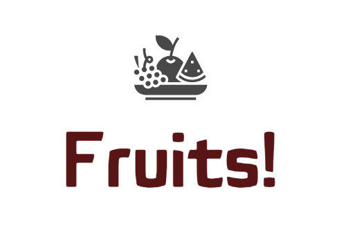

# P8-D-ployez-un-mod-le-dans-le-cloud

  &emsp;&emsp;&emsp;&emsp;&emsp;&emsp;&emsp;&emsp;&emsp;&emsp;&emsp;&emsp;&emsp;&emsp;&emsp;&emsp;&emsp;&emsp; 
   

### Mission :

On est chargé de développer dans un environnement Big Data une première chaîne de traitement des données qui comprendra le preprocessing et une étape de réduction de dimension.

### Les Données : 

L’existence d’un <a href="https://www.kaggle.com/moltean/fruits">jeu de données</a>&nbsp;constitué des images de fruits et des labels associés, qui pourra servir de point de départ pour construire une partie de la chaîne de traitement des données.

### Contraintes :
<ul>
<li>Vous devrez tenir compte dans vos développements du fait que le volume de données va augmenter très rapidement après la livraison de ce projet. Vous développerez donc des scripts en Pyspark et utiliserez par exemple le cloud AWS pour profiter d’une architecture Big Data (EC2, S3, IAM),&nbsp;basée sur un serveur EC2 Linux.</li>
<li>La mise en œuvre d’une architecture Big Data sous (par exemple) AWS peut nécessiter une configuration serveur plus puissante que celle proposée gratuitement (EC2 = t2.micro, 1 Go RAM, 8 Go disque serveur).</li>
</ul>